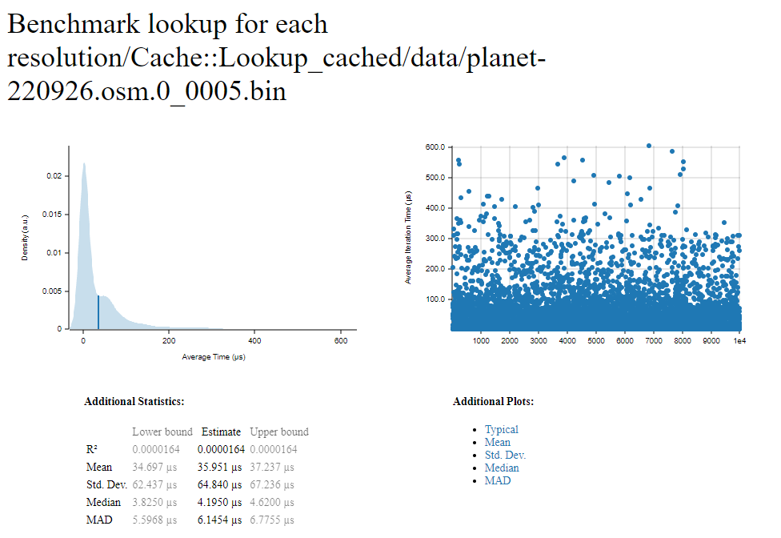
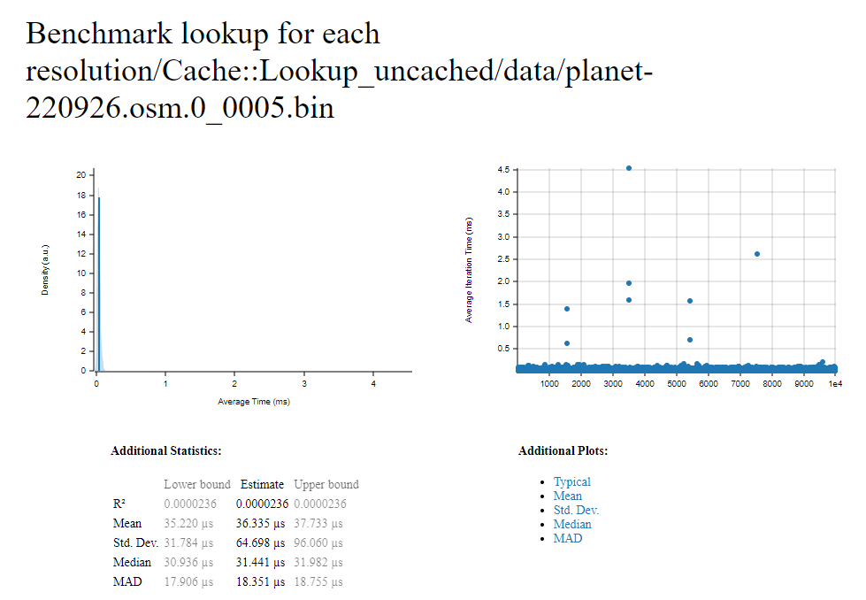

# Reverse Geocoding

An application that works as a memory cache to do a reverse geocoding.

## Contribution

Feel free to contribute by creating issues or PRs, it's my first Rust project and I did not have time to learn Rust (just trying to use my knowledge of the other languages). So any remarks or refactors would be welcomed.

## TODO

- [ ] Update README
- [ ] Add tests 
- [ ] Find a way to communicate between Java and this app

## Running the application

We are using [cargo](https://doc.rust-lang.org/cargo/) as a build system and dependencies manager.

### Formatting

To format the code, you can run this command:
````shell
cargo fmt
````

### Build

From the root directory, you can build the application using the following command:
````shell
cargo build
````

### Debug mode

```shell
cargo run --package reverse-geocoding --bin reverse-geocoding -- data/osm-20151130-1.0-2.bin
```

### Release mode

```
cargo run --package reverse-geocoding --bin reverse-geocoding --release -- data/osm-20151130-1.0-2.bin
```

### Testing

```
cargo test
```

### Benchmarking

```
cargo bench
```

#### Result

After running the benchmarking command, you will get a report `index.html` in the folder [report](./target/criterion/report) and you will get something like this.




As we can see, with the cached indexes is much faster than uncached one (Mind blowing)

>Note: Before running the benchmarks, you should download the OSM bin file with the resolution 0.0005 `461.4 Mb` either from [Google Drive](https://drive.google.com/file/d/1tCXnLN4TZ5UrDBDn3rhMEHm_KJVmG7O6/view?usp=sharing) or [Mega.nz](https://mega.nz/file/4M92UIzT#ogxhlKu7d2Yk3JuVSPQ_kgnly7LrnMs9PDCfiZRi3fg) and copy it to the folder [data](./data).

>Note: If you want to rebuild the OSM indexes with a better resolution, you can download the Gzip file `895.9 Mb` from [Google Drive](https://drive.google.com/file/d/1dzxfXNlHkHpK84u1ild8z-w8OB27yNXw/view?usp=sharing) or [Mega.nz](https://mega.nz/file/YFtm2QBb#6r_0yfVVmy5hVVxWw90-li8Ihw6URr2-emBb6AXlHj4)